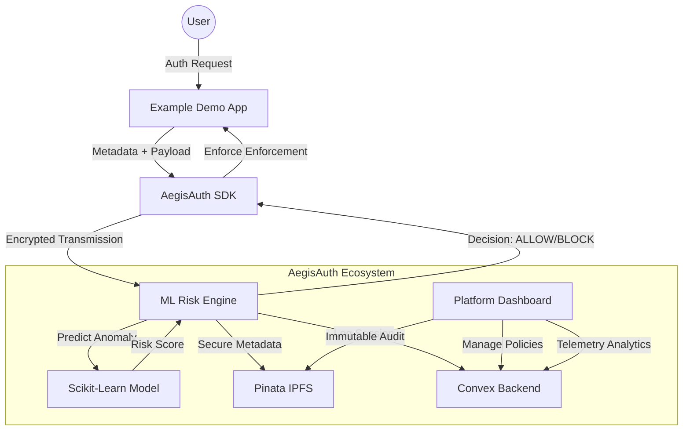

# AegisAuth: Adaptive Threat Intelligence & ML Security


**AegisAuth** is a next-generation adaptive authentication platform that leverages machine learning to detect and neutralize security threats in real-time. By analyzing behavioral telemetry and session metadata, AegisAuth provides dynamic enforcement policies that protect applications without compromising user experience.

---

## 🏗️ System Architecture

AegisAuth is built on a distributed, microservices-oriented architecture designed for scalability and low-latency decision making.



---

## 🚀 Key Pillars

### 1. ML-Driven Risk Assessment
The **ML Risk Engine** (FastAPI) utilizes a trained Scikit-Learn model to evaluate over 15+ behavioral signals, including:
- **Impossible Travel**: Detecting geo-velocity anomalies.
- **Pattern-Based Brute Force**: Identifying automated credential stuffing.
- **Device Fingerprinting**: Recognizing unauthorized device identity shifts.

### 2. Decentralized Secure Storage (IPFS)
To ensure maximum privacy and data immutability, sensitive user metadata is **AES-256 encrypted** and pinned to **IPFS via Pinata**. AegisAuth never stores raw sensitive telemetry in its primary database.

### 3. Adaptive Enforcement SDK
The `@devanshthaware/aegis-auth` SDK provides a plug-and-play integration for any frontend. It handles real-time challenges (MFA), automatic session termination, and risk-based step-up authentication.

### 4. Interactive Simulation Center
A dedicated environment to test security policies by "firing" simulated attack vectors (Brute Force, Malicious IPs) and watching the platform respond in real-time.

---

## 🛠️ Tech Stack

- **Frontend**: Next.js 16, TailwindCSS, Lucide Icons, Shadcn UI.
- **Backend (API)**: FastAPI, Uvicorn, Pydantic.
- **Database / Sync**: Convex (Managed Backend).
- **Decentralized Storage**: Pinata (IPFS).
- **ML / Data**: Scikit-Learn, Pandas, NumPy.
- **Infrastructure**: Docker & Docker Compose.

---

## 📦 Getting Started

### Prerequisites
- Docker & Docker Compose installed.
- `.env.local` files configured for each service (Convex URLs, Pinata JWT).

### One-Command Launch
Launch the entire ecosystem (Platform, Backend, and Demo App) with:

```bash
docker-compose up --build
```

### Accessing the Platform
- **Dashboard**: [http://localhost:3000](http://localhost:3000)
- **Security API**: [http://localhost:8000](http://localhost:8000)
- **Demo Application**: [http://localhost:3001](http://localhost:3001)

---

## 🛡️ Security Disclaimer
This project is developed for the **Raisoni Amravati Hackathon**. It is a functional demonstration of adaptive authentication and should be configured with production-grade encryption keys before live deployment.

**Created with ❤️ by the AegisAuth Team.**
